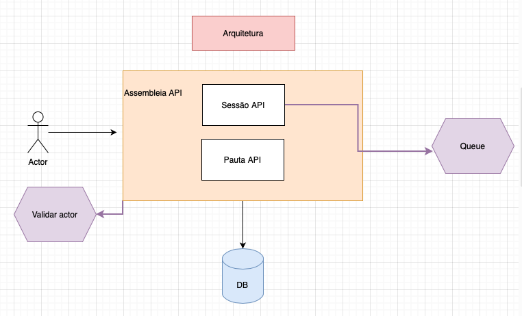
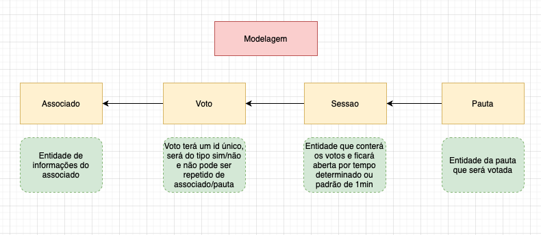

# Desafio Técnico South System

## 1.Objetivo

**Domínio**: Cadastro de **Pautas** e contabilização de **Votos** em **sSessão** por **Associado**.

No cooperativismo, cada associado possui um voto e as decisões são tomadas em assembleias, por votação. A partir disso, você precisa criar uma solução back-end para gerenciar essas sessões de votação. Essa solução deve ser executada na nuvem e promover as seguintes funcionalidades através de uma API REST:

* Cadastrar uma nova pauta;
* Abrir uma sessão de votação em uma pauta (a sessão de votação deve ficar aberta por um tempo determinado na chamada de abertura ou 1 minuto por default);
* Receber votos dos associados em pautas (os votos são apenas 'Sim'/'Não'. Cada associado é identificado por um id único e pode votar apenas uma vez por pauta);
* Contabilizar os votos e dar o resultado da votação na pauta.

## 2.Arquitetura da Solução

O serviço é uma API que deverá receber dados de pautas, sessão e votos, validar o cpf do associado e persistir os dados da votação em banco.
No momento do encerramento da sessão será feito o envio de uma mensagem para uma fila.



## 3.Modelagem
Foi criada uma solução simples de modelagem de entidades, visando apenas a solução básica do desafio permitindo 
que os requisitos sejam satisfeitos a contento.

Cada pauta criada pode ser associada a uma ou mais sessões e os votos são computados por sessão.
Os associados são validados no endereço externo e salvos na tabela do banco para evitar várias consultas repetidas ao serviço externo.


## 4.Recursos utilizados

### 4.1. Postgresql
Banco de dados escolhido por ser um dos que possui mais recursos e considerado leve e simples de criar e manter uma imagem para um conteiner. 
Durante o desenvolvimento foi utilizadod o h2 inicialmente para os testes iniciais, mas depois substuido pelo postgresql.

### 4.2. MyBatis
Para mapeamento objeto-relacional a escolha foi do mybatis pelo fato de ajudar a segregar o codigo sql aos arquivos xml e deixar os arquivos 
Java de entidade um pouco mais "limpos" de anotações relacionadas a banco de dados.

### 4.3. Kafka
Uma das plataformas mais populares de stream, é fácil de configurar e foi escolhida por ter maior 
documentação junto ao spring, uma opção fácil de implementar e gerar o resultado esperado. As mensagem são armazenadas no tópico *assembleia-resultados*

### 4.4. Golang
Criado um pequeno servidor em Golang apenas para ficar disponível para aplicação simulando validações de CPF, ele retorna de 
forma aleatória de um cpf está habilitado para votar ou não habilitado.

## 5.Como Executar o projeto
### 5.1 Executando com docker
Todos os scripts de execução encontram-se agrupados no arquivo compose.sh, bastando executá-lo criar todos os containeres 
necessários para visualizar a aplicação. Ficando exposto o endereço `http://localhost:8080`. 

```
sh compose.sh
```

Para acessar a documentação dos endpoints basta acessar: `http://localhost:8080/swagger-ui.html`
### 5.2 Alterando configurações de execução
Algumas configurações estão no arquivo application.yml  dentro da pasta `resources` que permite a adição de novos perfis de execução da aplicação
bastando adicionar as opções desejadas da seguinte forma:

```
---
spring:
    config:
        activate:
            on-profile: nome-perfil
... demais configurações...
```

## 6. Testes criados
Foram criados apenas dois cenários de testes unitários nos endpoints de criar recursos,
foi apenas uma forma de mostar o recurso de criação de testes usando JUnit e Mockito.

Testes de performance não foram implementados, a solução utilizaria o jmeter e 
seria adicionado para rodar antes do deploy da aplicação.

## 7. Performance
Por ser a primeira versão da api, não foi adicionado os recursos do webflux totalmente
de forma a trabalhar melhor com múltiplas requisições.